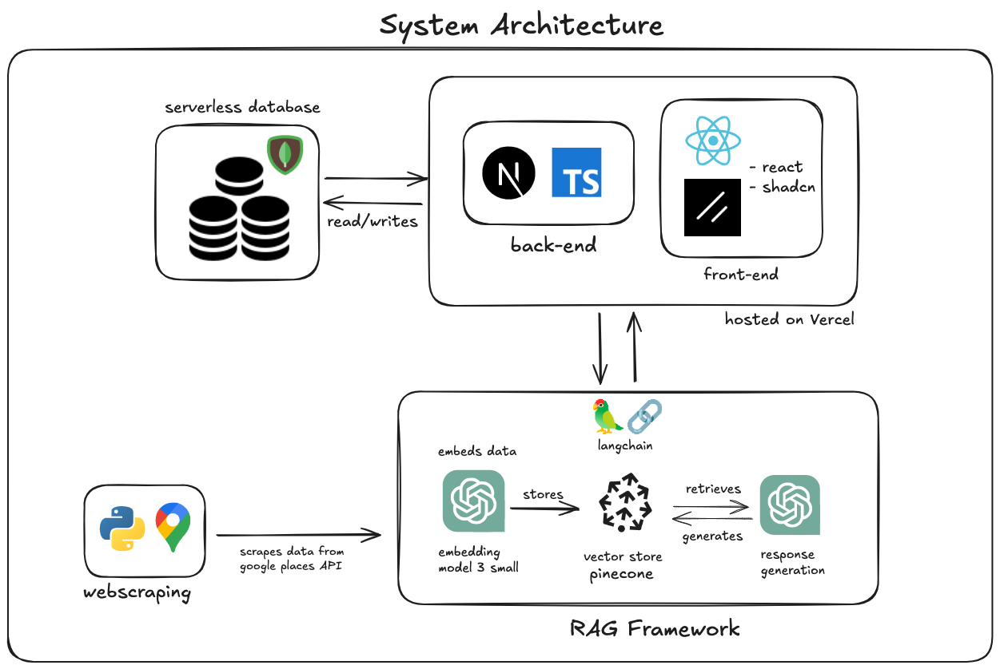

# Munch - Los Angeles

A chatbot designed to help users find food options in the Los Angeles area. This project leverages natural language processing (NLP) to understand user queries and integrates with various APIs to provide real-time information about restaurants, food types, and locations.

## Table of Contents

- [Architecture](#architecture)
- [Prerequisites](#prerequisites)
- [Setup](#setup)
- [Contributing](#contributing)

## Architecture



## Prerequisites

- [Node.js](https://nodejs.org/en/download/) (version 20.12+)
- [Yarn](https://yarnpkg.com/getting-started/install) (for frontend dependencies)
- Personal access token for [OpenAI](https://platform.openai.com/)
- API key for [Google Maps](https://developers.google.com/maps/documentation/places/web-service/get-api-key)
- Pinecone API key for [Pinecone](https://www.pinecone.io/)

## Setup

Follow these steps to set up the project on your local machine:

1. Clone the repository:

   ```bash
   git clone https://github.com/your-username/your-repo-name.git
   cd your-repo-name
   ```

2. Install dependencies:

   ```bash
   npm install
   # or
   yarn install
   ```

3. Set up environment variables:

   - Copy the `.env.example` file to `.env.local`
   - Update the variables in `.env.local` with your specific configuration

4. Run the development server:

   ```bash
   npm run dev
   # or
   yarn dev
   ```

5. Open your browser and navigate to `http://localhost:3000` to see the application running.

### Available Scripts

In the project directory, you can run:

- `npm run dev` or `yarn dev`: Starts the development server
- `npm run build` or `yarn build`: Builds the app for production
- `npm start` or `yarn start`: Runs the built app in production mode
- `npm run lint` or `yarn lint`: Runs the linter to check for code style issues

For more information on using Next.js, check out the [Next.js Documentation](https://nextjs.org/docs).

### Usage

To start the backend and frontend (run each step in separate terminals):

1. Launch the backend server:

   ```bash
   python backend/manage.py runserver
   ```

2. Launch the frontend:

   ```bash
   cd frontend
   npm install  # Only needed the first time
   npm run dev
   ```

## Contributing

We welcome contributions to MunchLA! If you're interested in improving the project, please follow these steps:

1. Fork the repository
2. Create a new branch for your feature or bug fix
3. Make your changes
4. Submit a pull request

For major changes, please open an issue first to discuss what you would like to change.

## License

This project is a proprietary website and is not open-source. All rights reserved. Unauthorized use, reproduction, or distribution of any part of this project is strictly prohibited.
